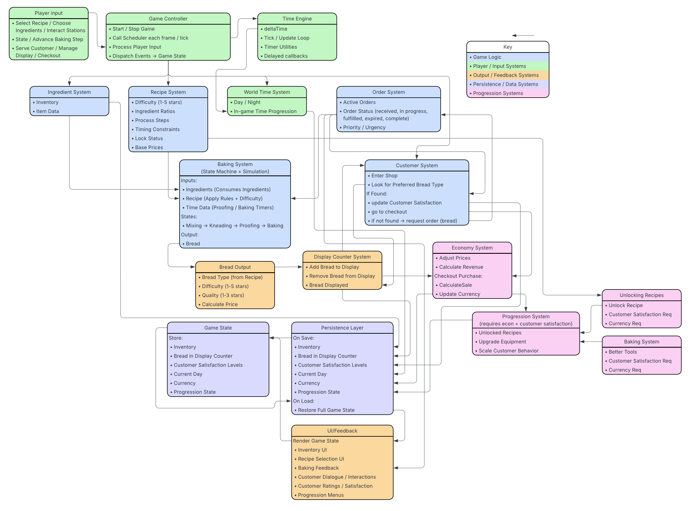

# 🍞 Bread & Butter — Notes/DevLog: Project Updates

This file tracks progress, milestones, changes in development, as well as an additional research or resources utilized.

**branch reminders**
- main branch: most stable version of the code
- development branch: system retainment
- wip branch: exploration of specific features before merging into main

## Week 1 (1/27 - 2/2)
- Capstone Project Idea finalized
- Github Repo for Butter created
- README file created
- Game Design Document file created

## Week 2 (2/3-2/9)
- Unity Project created
- A Game Loop Implemented
- Learned howt to create scipts, objects, and dbug in C#
- [How to Create a C# ilee](https://www.youtube.com/watch?v=C8vqAkUCJBg)
- [Unity Tutorial for Complete Beginners](https://www.youtube.com/watch?v=XtQMytORBmM&t=1079s)

## Week 3 (2/10 - 2/16)
- Bread-Butter Unity Project Restarted
- GitHub Repo streamlined as intended VCS
- **Baking System Finalized**
    1. Player selects recipe
    2. System checks required ingredients
    4. Baking minigame starts (leaves space for more later)
    5. Player presses button to stop timing bar
    6. System calculates accuracy
    7. Quality score is calculated
    8. Bread object is created and placed in display inventory
- **Starter Bread Options Selected**
    - White Loaf
    - Whole Wheat
    - Baguette
    - Sourdough
- **Upgrade System**
    1. Oven upgrade 
        - Decreases the difficulty of baking bread
        - Adding quality bonus
    2. Display Upgrade
        - Adds more slots to sell bread
- **Reputation System (Hidden variable)**
    - Increases based on:
        - Number of different types of bread sold
        - Average customer satisfaction
        - Number of returning customers
    - Affects:
        - Customer spawn rate
        - Chance of higher-paying customers
        - Tips given by customers
- incredibly barebones implementation complete
- GameManager, BakingSystem, and DisplaySystem Created
- bread baking verified
- Tested & verified the ability to bake bread
- [How to set up a GameManager](https://discussions.unity.com/t/help-how-do-you-set-up-a-gamemanager/473071)
- [How to Create 2D Sprites & Import them into Unity](https://www.youtube.com/watch?v=bKgi6WcXtCY)
- [How to make 2D game art!](https://www.youtube.com/watch?v=bKgi6WcXtCY)
- [Beginnrs Guide to Creating Realistic Graphics](https://www.youtube.com/watch?v=fBQvL5YR3eg)

## Week 4 (2/17 - 2/23)
- Saved week 3 files to desktop to get a clean version
- Rewrote GameManager Engine
- TestButtons/Interactions Created: Baking Bread, Customers Purchasing Bread
- Created different bread objects (to be expanded on later)
- 
- [Unity Tutorial for Beginners](https://www.youtube.com/watch?v=XtQMytORBmM&t=1079s)

## Week 5 (2/24 - 3/2)
- prints out bread available in the shop
- customer spawner

## Week 6 (3/3 - 3/9)
- CustomerUIPrefab
- Button fixes (Buying and selling bread)
- Money & Purchasing system corrected
- BreadPrefab created (making the game more scalable)
- Working on the basic interaction in a simple bakery scene
- [How to work with multiple scenes in Unity](https://www.youtube.com/watch?v=zObWVOv1GlE)
- [How to Create a Prefab](https://docs.unity3d.com/6000.3/Documentation/Manual/CreatingPrefabs.html#:~:text=Create%20a%20prefab%20asset,-To%20create%20a&text=See%20in%20Glossary%20and%20configure,new%20variants%20from%20the%20GameObjects.)
- [Step by Step Unity Guide](https://learn.unity.com)

## Week 7 (3/10 - 3/16)
- player (white block placeholder) moves freely on the screen
- static camera centered on player
- player interaction system is cooked (fixed, it bakes something or at least pretends to rn)
- player spawns in with ingredients, kneeds dough, shapes it, bakes, and successfully puts it in the display

## Week 8 (3/17 - 3/23)
- unity project imported to laptop without (Evident) errors
- [Aseprite - Asset Creation Website](https://www.aseprite.org/)
- [Piskel - Asset Creation Website](https://www.piskelapp.com/)

## Week 9 + 10 (3/24 - 4/7)
- Event bus research
    - [What is an Event Bus?](https://www.akamai.com/glossary/what-is-an-event-bus)
    - [What is an event bus, what does it do, and what's it's purpose?](https://medium.com/@syed.abu.hanifah16/what-is-an-event-bus-what-it-does-and-its-purpose-a8a2437b3879)
    - [Why don't you use an event bus?](https://discussions.unity.com/t/why-dont-you-use-eventbus/940577/2)
- [Time in Unity](https://docs.unity3d.com/ScriptReference/Time.html)
- Made the customer spawner actually spawn customers (3 for now)
    - to fix: customer spawner is starting at the start of day 1, but should be when the shop opens 
    - to fix: keydy is not buying the whiteloaf?
- implemented most of the baking steps
- adjusted beginning inventory numbers
- added a "shop open" sign to allow switching into the next phase of gameplay
- full system map created

## Week 11 (4/8 - 4/14)
- changes
- 
- 
- 
- system design diagram implemented

**to-do list**
- build a system diagram of how unity works (how they interact with the unity engine to make the game work)
- build something out without the squares
- how the game dynamics interact with the game system
- gameplay + system design
- visuals
- my components x unity engine
- lean into research and system design

## Week 12 ()
- changes
- 
- 
- 
-
**to-do list**

## Week 13 ()
- changes
- 
- 
- 
- **to-do list**

## Week 14 ()
- changes
- 
- 
- 
-
**to-do list**

## Week 15 ()
- changes
- 
- 
- 
- 
**to-do list**

## Week 16 ()
- changes
- 
- 
- 
-
**to-do list**

